# 🦅 SKY: Real-Time UAV Vision & Target Flag Identification System

Welcome to the **SKY** codebase. This repository contains the complete real-time computer vision and decision pipeline designed for autonomous UAVs to detect, track, verify, and approach target flags. It is built to run efficiently under strict real-time constraints during field testing and competitions.

The system utilizes **YOLOv8** for rapid target localization, **DINOv2** for high-fidelity visual feature embedding, **FAISS** for fast similarity retrieval, and a custom **Temporal State Machine** to output navigation instructions directly to the UAV's flight controller.

---

## ⚙️ System Architecture

The pipeline consists of two distinct phases:
1. **Offline Phase (Database Building)**: Synthesizes target flag images under multiple flight altitudes, pitches, wind conditions, and sensor noise to build an embedding database stored in a FAISS index.
2. **Online Phase (Real-Time Pipeline)**: Runs on the UAV's onboard computer, processing camera frames and sending navigation commands to the flight controller.

```mermaid
flowchart TD
    subgraph Offline["Offline Phase"]
        TI["Target Image"] --> GEN["Dataset Generator<br/>(generate_target_img.py)"]
        GEN --> DB["Embedding Database Builder<br/>(DINOv2 + FAISS)"]
        DB --> IDX["Saved FAISS Index<br/>(index.faiss + labels.json)"]
    end

    subgraph Online["Online Phase (Per Frame)"]
        CAM["Camera / Video Feed"] --> YOLO["YOLOv8 Detector"]
        YOLO --> TRACK["OC-SORT Multi-Object Tracker"]
        TRACK --> SELECT["Top-N Candidate Crop Selector"]
        SELECT --> DINO["DINOv2 Embedding Extraction"]
        DINO --> FAISS["FAISS Query (Top-K Neighbors)"]
        FAISS --> SCORER["Hybrid Similarity Scorer<br/>(Margin, Votes, Bbox Score)"]
        SCORER --> DECISION["Decision Manager State Machine"]
        DECISION --> NAV["Navigation Command Output"]
        DECISION --> HUD["HUD & Video Visualizer"]
    end
```



---

## 📁 Repository Structure

```
SKY/
├── README.md                      # This main project overview and guide
│
├── target_img/                    # Synthetic target database generation
│   ├── assets/                    # Textures (flags, backgrounds)
│   ├── target_database_img/       # Generated image folders (target/, Confusing_target/)
│   ├── config.yaml                # Camera, wind, and augmentation parameters
│   └── generate_target_img.py     # Script to generate synthetic target image sets
│
├── Generate_video_to_test/        # Synthetic video generation for simulation
│   ├── generate_test_video.py     # Script to generate synthetic UAV flight video
│   └── test_video_config.yaml     # Path, wind, and flight path config
│
├── test_video/                    # Flight videos for local desktop validation
│   └── video.mp4                  # Main simulation video file
│
├── test_video_output/             # Debug video output from runs
│   └── debug_output.mp4           # Rendered HUD overlay video
│
└── vision_system/                 # Core real-time vision system
    ├── config.yaml                # Scorer, tracker, & state thresholds
    ├── readme.md                  # Original vision system specification sheet
    ├── run_build_database.py      # Builds the FAISS embedding index from target images
    ├── run_pipeline.py            # Main entry point to run real-time inference
    ├── vision_events.json         # State transition history log
    ├── weights/                   # YOLO weights folder (e.g. best.pt)
    └── core/                      # Pipeline source modules
        ├── database_builder.py    # DINOv2 embedding extraction for DB
        ├── embedding_model.py     # Preprocessing and PyTorch DINOv2 wrapper
        ├── similarity_scorer.py   # Margin, vote-fraction, and weighted similarity math
        ├── target_tracker.py      # OC-SORT tracker with Kalman filtering
        ├── decision_manager.py    # Temporal State Machine & Unified Confidence math
        ├── pipeline.py            # System orchestrator coupling all steps
        └── visualizer.py          # OpenCV HUD, scrolling log, & bounding box overlay
```

---

## 💻 Running on a Laptop (Development & Desktop Testing)

Laptops have CUDA-enabled GPUs, making them ideal for running high-frequency simulations, visualizing state transitions, and tuning threshold configurations.

### 1. Installation
Install the required dependencies inside your Python 3.10+ environment:
```bash
pip install torch torchvision numpy opencv-python pyyaml ultralytics tqdm

# Install CPU or GPU version of FAISS depending on your system:
pip install faiss-cpu
# OR if you have CUDA setup:
# pip install faiss-gpu
```

### 2. Generate Target Images (Offline Step 1)
Generate augmented versions of your target templates (e.g., simulating rotation, motion blur, and desert terrain lighting):
```bash
cd target_img
python generate_target_img.py --config config.yaml --num-images 200
```
This saves images to `target_img/target_database_img/target/` and `target_img/target_database_img/Confusing_target/`.

### 3. Build the Embedding Database (Offline Step 2)
Process the generated images through DINOv2 and compile the FAISS database index:
```bash
cd ../vision_system
python run_build_database.py --config config.yaml --db-path ../target_img/target_database_img --output-dir ./embeddings
```
This outputs `embeddings/index.faiss` and `embeddings/labels.json`.

### 4. Run the Pipeline on a Test Video (Online Step)
Execute the real-time detection, tracking, and verification loop:
```bash
python run_pipeline.py --config config.yaml --source ../test_video/video.mp4
```
* **Visual Output**: The system outputs an annotated file named `debug_output.mp4` (specified in `config.yaml`) featuring a real-time HUD, tracking vectors, scrolling transition logs, and candidate confidence reports.
* **Live View**: To display it live on screen, open `run_pipeline.py` and uncomment the `cv2.imshow` block in `main()`.

---

## 🍓 Running on a Raspberry Pi (Flight Controller Guide)

Running on a Raspberry Pi (e.g., Pi 4 or Pi 5) requires hardware-specific optimizations. PyTorch is heavy and slow on ARM CPUs, meaning DINOv2 extraction becomes the primary frame-rate bottleneck.

Follow these optimization steps to run the pipeline on the drone's companion computer:

### 1. Export Models to ONNX / TFLite
Avoid running raw PyTorch models onboard. Instead, compile and export both models to ONNX to leverage the CPU's NEON vector extensions and XNNPACK acceleration.

#### A. Export YOLOv8 to ONNX
You can export YOLO natively using the Ultralytics CLI:
```bash
yolo export model=weights/best.pt format=onnx imgsz=640 half=True
```
Update your `config.yaml` to point `yolo_weights` to the exported `best.onnx` file.

#### B. Export DINOv2 to ONNX
Create a script `export_dinov2.py` on your laptop to compile the PyTorch model to ONNX:
```python
import torch
import os

# Load PyTorch model
model = torch.hub.load('facebookresearch/dinov2', 'dinov2_small', pretrained=True)
model.eval()

# Dummy input representing (batch_size, 3, 224, 224)
dummy_input = torch.randn(1, 3, 224, 224)

# Export to ONNX
torch.onnx.export(
    model,
    dummy_input,
    "dinov2_small.onnx",
    opset_version=14,
    do_constant_folding=True,
    input_names=['input'],
    output_names=['output'],
    dynamic_axes={'input': {0: 'batch_size'}, 'output': {0: 'batch_size'}}
)
print("DINOv2 successfully exported to ONNX format!")
```
Transfer the output `dinov2_small.onnx` file onto the Raspberry Pi.

### 2. Implement ONNX Runtime Inference
Instead of `EmbeddingModel` using `torch.hub.load`, install ONNX Runtime on the Pi:
```bash
pip install onnxruntime
```
Use the following class inside `vision_system/core/embedding_model.py` (or as a fallback) to run ONNX Runtime with optimized CPU thread usage:
```python
import onnxruntime as ort
import numpy as np
import cv2

class ONNXEmbeddingModel:
    def __init__(self, model_path="dinov2_small.onnx"):
        # Optimize CPU threads for the Pi's quad-core architecture
        opts = ort.SessionOptions()
        opts.intra_op_num_threads = 4  
        opts.execution_mode = ort.ExecutionMode.ORT_SEQUENTIAL
        
        self.session = ort.InferenceSession(
            model_path, 
            sess_options=opts, 
            providers=['CPUExecutionProvider']
        )
        self.input_name = self.session.get_inputs()[0].name

    def extract(self, bgr_image: np.ndarray) -> np.ndarray:
        # Preprocess: BGR -> RGB -> Resize (224x224) -> Normalize
        rgb = cv2.cvtColor(bgr_image, cv2.COLOR_BGR2RGB)
        resized = cv2.resize(rgb, (224, 224), interpolation=cv2.INTER_CUBIC)
        
        # ImageNet normalization
        img_data = resized.astype(np.float32) / 255.0
        mean = np.array([0.485, 0.456, 0.406], dtype=np.float32)
        std = np.array([0.229, 0.224, 0.225], dtype=np.float32)
        img_data = (img_data - mean) / std
        
        # HWC -> CHW -> BCHW
        img_data = np.transpose(img_data, (2, 0, 1))
        img_data = np.expand_dims(img_data, axis=0)

        # Run inference
        outputs = self.session.run(None, {self.input_name: img_data})
        embedding = outputs[0][0]  # shape (384,)
        
        # L2-normalization
        norm = np.linalg.norm(embedding)
        if norm > 1e-6:
            embedding = embedding / norm
        return embedding
```

### 3. Lightweight Similarity Scoring (No-FAISS Fallback)
If installing FAISS on the Raspberry Pi's operating system causes compilation/wheel issues, you can replace the FAISS index search with a pure **NumPy Cosine Similarity check**. Since the database contains only a few hundred embeddings, NumPy matrix operations are highly optimized and run in sub-millisecond times:
```python
# Fallback calculation inside core/similarity_scorer.py
# If self.index is a numpy array instead of a FAISS index:
# queries: (1, 384), database_matrix: (N, 384)
similarities = np.dot(database_matrix, query_vector)  # Cosine similarity for L2-normed vectors
top_k_indices = np.argsort(similarities)[::-1][:k]
top_k_sims = similarities[top_k_indices]
```

### 4. Frame Budgeting & Execution Control (FPS Boosters)
To keep latency low, configure the pipeline runtime settings as follows:
* **Reduce Candidate Slots**: Set `max_candidates: 1` in `config.yaml` so the Pi only verifies the highest-scoring YOLO candidate per frame, rather than running DINOv2 multiple times.
* **Verification Rate Limits**: Modify the main loop in `run_pipeline.py` to only process DINOv2 extraction when a tracker enters the `VERIFYING` or `INVESTIGATING` states. While in the `SEARCHING` or `APPROACHING` phases, bypass DINOv2 entirely and run only the fast YOLO detector to save CPU cycles.
* **Temporal Frame Skipping**: Run YOLO and the OC-SORT tracker on every frame, but perform DINOv2 verification only once every 3 frames. Use the tracker's Kalman Filter predictions to maintain target bounding box associations on intermediate frames.

---

## ✈️ Flight Controller Integration

The vision pipeline communicates navigation intent to the drone controller using the `NavigationCommand` data structure emitted by the `DecisionManager`.

### 1. Navigation Command Schema
```python
@dataclass
class NavigationCommand:
    action: str                     # "approach", "hold", "orbit", "abort"
    target_center_px: Tuple[int, int]  # (cx, cy) in pixel coordinates
    offset_from_center: Tuple[float, float]  # Normalized [-1.0, 1.0] centering offsets (X, Y)
    bbox_area_ratio: float          # Bbox area / Frame area ratio (represents proxy distance)
    estimated_approach_needed: bool # True if bbox_area_ratio is too small
    confidence: float               # C_temporal (smooth target probability)
    track_id: int                   # Active tracking ID
```

### 2. State Machine Transitions
The flight controller should read the active state and coordinate corresponding UAV maneuvers:

```
                  ┌────────────────┐
                  │   SEARCHING    │ ◄─── (YOLO detection lost)
                  └───────┬────────┘
                          │ (YOLO Conf >= 0.35)
                          ▼
                  ┌────────────────┐
                  │ INVESTIGATING  │
                  └──────┬───┬─────┘
  (C_final < 0.45        │   │       (C_final >= 0.55
   AND BBox < 0.4)       │   │        AND BBox >= 0.4)
           ┌─────────────┘   └─────────────┐
           ▼                               ▼
  ┌────────────────┐               ┌────────────────┐
  │  APPROACHING   ├──────────────►│   VERIFYING    │
  └──────┬─────────┘ (BBox >= 0.4) └───────┬────────┘
         │ (Low Conf                       │ (C_temporal >= 0.70
         │  Streak)                        │  for 5+ frames)
         ▼                                 ▼
  ┌────────────────┐               ┌────────────────┐
  │  SOFT_REJECT   │               │   CONFIRMED    │
  └──────┬─────────┘               └────────────────┘
         │ (Double Failure
         │  Streak)
         ▼
  ┌────────────────┐
  │    REJECTED    │
  └────────────────┘
```

* **`SEARCHING`**: Target not found. The controller flies along predefined survey waypoints.
* **`INVESTIGATING`**: Target sighted by YOLO. The UAV maintains altitude, centering the camera on the target coordinates using `offset_from_center`.
* **`APPROACHING`**: Target is too far / small (bbox area ratio is low). The controller adjusts pitch and altitude to fly closer to the target center.
* **`VERIFYING`**: Bounding box size is large enough. The UAV hovers in place to compile visual embeddings and verify target authenticity.
* **`SOFT_REJECT`**: A temporary dip in score. The UAV holds position to re-verify. If it fails again, it transitions to `REJECTED`, and the controller resumes survey waypoints (applying a spatial exclusion zone around this target's coordinate).
* **`CONFIRMED`**: Target verified successfully. The drone initiates landing or target release protocols.

### 3. How the Flight Controller Processes Centering Offsets
When a command specifies `offset_from_center = (dx, dy)`:
* **`dx`** represents the target's horizontal offset (yaw axis). If `dx < 0`, rotate the UAV left; if `dx > 0`, rotate right.
* **`dy`** represents the vertical offset (pitch axis). If `dy < 0`, pitch the UAV forward (or climb); if `dy > 0`, pitch backward (or descend).
* **Scaling**: Apply proportional-integral-derivative (PID) control to `dx` and `dy` to center the target at `(0.0, 0.0)` in the camera frame prior to entering `VERIFYING` or `CONFIRMED` states.
