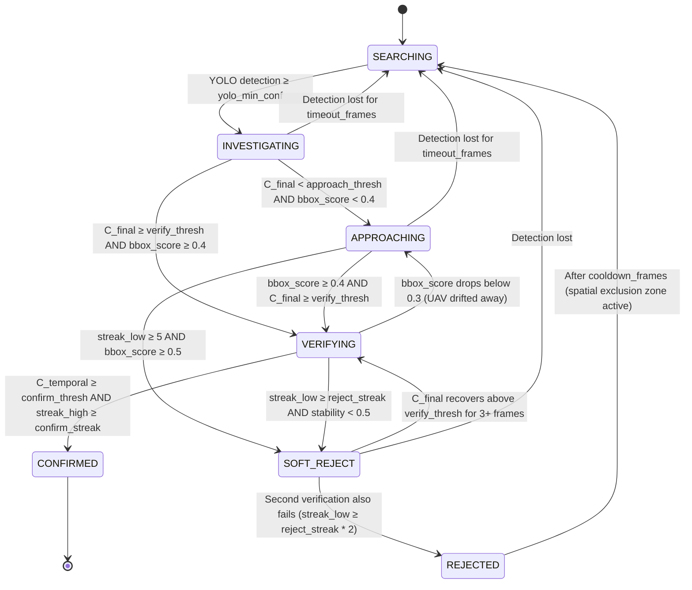

# UAV Real-Time Vision Pipeline — Revised Architecture

## 1. System Overview

Two-phase system: **Offline** (build embedding database) and **Online** (real-time detection + identification loop).

```mermaid
flowchart TD
    subgraph Offline["Offline Phase"]
        TI["Target Image"] --> GEN["Dataset Generator<br/>(already built)"]
        GEN --> DB["Embedding Database Builder<br/>DINOv2 + FAISS"]
        DB --> IDX["Saved FAISS Index<br/>+ label map"]
    end

    subgraph Online["Online Phase — per frame"]
        CAM["Camera Frame"] --> YOLO["YOLO Detector"]
        YOLO --> TOPN["Top-N Candidate<br/>Selector"]
        TOPN --> DINO["DINOv2 Embedding<br/>per candidate crop"]
        DINO --> FAISS["FAISS Query<br/>Top-K neighbors"]
        FAISS --> SIM["Similarity Scorer<br/>(margin + voting)"]
        SIM --> USC["Unified Score<br/>Computation"]
        USC --> SM["State Machine<br/>Decision Manager"]
        SM --> NAV["Navigation Output<br/>(offsets, commands)"]
        SM --> VIS["Visual Debugger"]
    end
```



---

## 2. Similarity Method Analysis

> [!IMPORTANT]
> **Your request:** Don't assume Top-K Average; compare alternatives and justify the final choice.

### 2.1 Candidate Methods

| Method | How it works | Pros | Cons | UAV Suitability |
|--------|-------------|------|------|-----------------|
| **1-NN (Nearest Neighbor)** | Cosine similarity to single closest database vector | Fastest; zero aggregation | Extremely noise-sensitive; a single outlier embedding in the DB flips the result | ❌ Too fragile |
| **Top-K Average** | Mean similarity of K nearest neighbors | Smooth; robust to DB outliers | Treats all K neighbors equally; a few weak augmentations drag the mean down; does not discriminate *which* target folder matched | ⚠️ Decent baseline |
| **Top-K Majority Voting** | Each of K neighbors "votes" for its folder label; winner is the match; similarity = fraction of votes for winner | Handles multi-target DBs natively; robust to outlier vectors | Requires >1 target folder to be meaningful; vote fraction is coarse (e.g., 7/10 vs 8/10 provides weak resolution) | ✅ Good for multi-target |
| **Margin-Based (Best vs Second-Best)** | `margin = sim_best - sim_second_best`; high margin = confident | Directly measures *discriminability*; catches "looks like two targets equally" | Requires ≥2 target folders; margin alone does not capture absolute similarity quality | ✅ Critical safety signal |
| **Hybrid: Weighted Top-K + Margin + Vote** | Combine weighted mean sim, vote fraction, and margin into a single score | Captures all three axes: raw similarity, label consistency, and discriminability | Slightly more compute (negligible) | ✅✅ **Best for competition** |

### 2.2 Chosen Method: **Hybrid Scorer**

For each detection crop, FAISS returns the Top-K (K=20) nearest neighbors. From these we compute **three sub-scores**:

1. **`sim_wk`** — **Weighted Top-K Similarity**: Neighbors are weighted by `1/rank` (position 1 gets weight 1.0, position 2 gets 0.5, position 3 gets 0.33, …). This gives higher importance to closer matches while still averaging over many vectors for noise suppression.

2. **`vote_frac`** — **Vote Fraction**: The fraction of the K neighbors that belong to the winning target folder. If there is only one target in the database, this is always 1.0 and has no effect. With multiple targets, it distinguishes ambiguous regions.

3. **`margin`** — **Similarity Margin**: `best_target_avg_sim - second_best_target_avg_sim`. When there is only one target, `margin = best_target_avg_sim` (since second-best = 0). With multiple targets, a low margin means "this crop looks like two different targets almost equally" → dangerous to confirm.

**Why this combination:**
- `sim_wk` answers: "How similar is this crop to the database in general?"
- `vote_frac` answers: "Do all the nearest neighbors agree on *which* target this is?"
- `margin` answers: "Is there a clear winner, or is the match ambiguous?"

No single sub-score captures all three dimensions. In a competition, you **will** encounter distractors (visually similar flags that are not the target). Margin and vote fraction catch these; raw similarity alone cannot.

---

## 3. Unified Target Confidence Score

> [!IMPORTANT]
> **Your request:** Propose a unified confidence that combines YOLO conf, similarity, margin, bbox size, and temporal stability.

### 3.1 Per-Frame Instantaneous Score

```
C_instant = w_yolo * yolo_conf
          + w_sim  * sim_wk
          + w_margin * margin
          + w_vote * vote_frac
          + w_bbox * bbox_score
```

Where:
- `yolo_conf` ∈ [0, 1] — raw YOLO detection confidence
- `sim_wk` ∈ [0, 1] — weighted top-K similarity (already normalized since cosine sim of L2-normalized vectors is in [0,1])
- `margin` ∈ [0, 1] — similarity margin, clamped
- `vote_frac` ∈ [0, 1] — vote fraction
- `bbox_score` ∈ [0, 1] — `min(bbox_area / ideal_area, 1.0)` where `ideal_area` is the target area at the ideal verification distance (e.g., 5% of frame area). Below ideal → linearly scaled down. Above → capped at 1.0.

**Default weights** (tunable in config):

| Weight | Value | Rationale |
|--------|-------|-----------|
| `w_yolo` | 0.15 | YOLO tells us *something is there*, but not *which* flag it is |
| `w_sim` | 0.35 | Primary identity signal |
| `w_margin` | 0.20 | Critical for discriminating distractors |
| `w_vote` | 0.10 | Agreement signal; less weight if single-target DB |
| `w_bbox` | 0.20 | Prevents confirming tiny far-away objects; rewards close-up |

### 3.2 Temporal Smoothing → `C_temporal`

Single-frame decisions are dangerous in UAV environments (motion blur, frame drops, sun glare). We maintain a **rolling window** of the last `N` frames (default N=8) for each tracked detection.

```
C_temporal = (1 - α) * EMA_previous + α * C_instant
```

With exponential moving average factor `α = 0.3` (strong smoothing, slow to react to single-frame glitches, but responsive enough for a real approach maneuver over ~1-2 seconds at 15 FPS).

Additionally, we track:
- **`streak_high`**: consecutive frames where `C_instant > threshold_high`
- **`streak_low`**: consecutive frames where `C_instant < threshold_low`
- **`stability`**: `1.0 - std_dev(last N C_instant values)` — penalizes flickering scores

The **final decision score** is:

```
C_final = C_temporal * stability
```

This ensures that a detection that jumps wildly between 0.3 and 0.9 is treated as unreliable even if its mean is acceptable.

---

## 4. Multi-Candidate Evaluation Strategy

> [!IMPORTANT]
> **Your request:** Don't process only the largest detection; evaluate the top N candidates.

### Strategy: Top-N by YOLO Confidence, with budget control

Each frame, YOLO may produce multiple detections. We:
1. **Sort** detections by YOLO confidence (descending).
2. **Take the top N** (configurable, default `N=3`) detections that pass `yolo_min_conf`.
3. **Run DINOv2** on all N crops. DINOv2 on a 224×224 crop is ~15-25ms on GPU; 3 crops ≈ 50-75ms, still well within budget at 10-15 FPS target.
4. **Track each candidate independently** with its own temporal history (via a lightweight tracker that matches detections across frames by IoU).

If YOLO produces more than N detections, the remaining ones are logged but not verified by DINOv2 until a higher-ranked candidate is rejected or confirmed, freeing a slot.

**Why not "largest" or "most prominent"?**
- The actual target may be partially occluded or at an angle, making it appear smaller than a distractor that is head-on.
- YOLO confidence is a better prior than bbox size for initial triage.
- Size is already captured by `bbox_score` inside the unified confidence.

---

## 5. State Machine — Revised



### Key changes from v1:

| Issue in v1 | Fix in v2 |
|-------------|-----------|
| Large bbox + low sim → immediate REJECTED | Added **SOFT_REJECT** state: first failure triggers re-verification; only persistent failure over many frames leads to hard REJECTED |
| Single-frame transitions | All critical transitions require **streak counts** (consecutive frames meeting the condition) |
| No temporal smoothing | `C_temporal` with EMA + stability factor governs all transitions |
| No re-entry from rejection | SOFT_REJECT can recover back to VERIFYING if scores improve |

### 5.1 Threshold Defaults (tunable in config)

| Parameter | Default | Meaning |
|-----------|---------|---------|
| `yolo_min_conf` | 0.35 | Minimum YOLO confidence to trigger INVESTIGATING |
| `approach_thresh` | 0.45 | C_final below which we approach instead of verify |
| `verify_thresh` | 0.55 | C_final needed to enter VERIFYING |
| `confirm_thresh` | 0.70 | C_temporal needed for CONFIRMED |
| `confirm_streak` | 5 | Consecutive high-confidence frames to confirm |
| `reject_streak` | 8 | Consecutive low-confidence frames to soft-reject |
| `timeout_frames` | 30 | Frames without matching detection before returning to SEARCHING |
| `cooldown_frames` | 60 | Frames to suppress re-detection at the same spatial location after REJECTED |

### 5.2 APPROACHING → Controller Navigation Output

> [!IMPORTANT]
> **Your request:** Define how target localization information is passed to the controller.

When the state machine is in `APPROACHING`, each frame the system emits a `NavigationCommand` struct:

```python
@dataclass
class NavigationCommand:
    """Guidance output sent to drone flight controller."""
    action: str                     # "approach", "hold", "orbit", "abort"
    target_center_px: Tuple[int, int]  # (cx, cy) in frame pixels
    offset_from_center: Tuple[float, float]  # Normalized [-1, 1] offset from frame center
                                              # (-1,-1)=top-left, (0,0)=centered, (1,1)=bottom-right
    bbox_area_ratio: float          # bbox area / frame area — proxy for distance
    estimated_approach_needed: bool # True if bbox_area_ratio < target_area_ratio
    confidence: float               # C_temporal for this track
    track_id: int                   # Which tracked detection this command refers to
```

**How the drone controller uses this:**
- `offset_from_center` → translate to yaw/pitch corrections (e.g., if offset.x = -0.3, yaw left)
- `bbox_area_ratio` → if small, descend or fly forward; if at target size, hold altitude
- `action` → "approach" means "reduce distance to target"; "hold" means "stay at current position for verification"; "orbit" means "circle at current distance for a second look"

---

## 6. Visual Debugging Overlay — Extended

> [!IMPORTANT]
> **Your request:** Include margin, target confidence, second-best match, and state transitions.

All overlays are drawn with OpenCV primitives (no GUI framework). Output is either:
- Written to a video file (`.mp4`) for post-mission review
- Streamed via a simple MJPEG server (if network is available) for live monitoring
- Or displayed via `cv2.imshow` on a connected monitor during bench testing

### Per-Detection Overlay

For each tracked candidate:

```
┌─────────────────────────────────────────────┐
│  YOLO bbox (color-coded by state)           │
│                                             │
│  Top-left label block:                      │
│    Track #2 | STATE: VERIFYING              │
│    YOLO: 0.87  |  BBox: 142×98 (2.1%)      │
│    Sim(wk): 0.74  |  Margin: 0.31           │
│    Vote: 8/10 target_1                      │
│    C_inst: 0.72  |  C_temp: 0.68            │
│    2nd best: target_3 (sim=0.43)            │
│    Streak: ↑↑↑↑↑ (5 high)                  │
│                                             │
└─────────────────────────────────────────────┘
```

### State color coding

| State | Box Color | Meaning |
|-------|-----------|---------|
| SEARCHING | — (no box) | No active track |
| INVESTIGATING | Yellow | Evaluating |
| APPROACHING | Cyan | Moving closer |
| VERIFYING | Orange | Accumulating evidence |
| SOFT_REJECT | Magenta | Failed once, re-checking |
| CONFIRMED | Green | Target confirmed |
| REJECTED | Red | Target rejected |

### Global HUD (top of frame)

```
Frame: 1247 | FPS: 14.2 | Tracks: 3 | State Summary: 1×VERIFYING, 1×APPROACHING, 1×INVESTIGATING
Active Target: target_1 (DB: 847 embeddings)
```

### State Transition Log (bottom of frame, scrolling)

```
[F1203] Track#2: INVESTIGATING → APPROACHING (C_final=0.42, bbox=1.3%)
[F1218] Track#2: APPROACHING → VERIFYING (C_final=0.61, bbox=4.7%)
[F1226] Track#2: VERIFYING → CONFIRMED ✓ (C_temp=0.74, streak=6)
```

---

## 7. Computational Complexity & Bottleneck Analysis

| Component | Per-Frame Cost | Notes |
|-----------|---------------|-------|
| YOLO inference | ~10-20ms (GPU) | Single full-frame pass |
| Crop extraction | <1ms | NumPy slicing |
| DINOv2 inference (per crop) | ~15-25ms (GPU) | 224×224 input |
| DINOv2 × 3 crops | ~50-75ms | This is the bottleneck |
| FAISS Top-K query (per crop) | <1ms | IndexFlatIP is extremely fast for <50K vectors |
| Hybrid scoring | <0.5ms | Pure arithmetic |
| State machine logic | <0.5ms | Simple conditionals |
| Visual overlay drawing | ~2-5ms | OpenCV primitives |
| **Total per frame** | **~70-100ms** | **~10-14 FPS** |

**Primary bottleneck:** DINOv2 inference on multiple crops. Mitigations:
1. Batch the N crops into a single `torch.stack()` forward pass → reduces GPU kernel launch overhead.
2. If FPS must be higher, process DINOv2 every 2nd frame and interpolate scores.
3. Use `torch.inference_mode()` and `torch.cuda.amp` (FP16) for DINOv2 to halve memory bandwidth.

---

## 8. File Structure

All code goes into `vision_system/`:

```
vision_system/
├── __init__.py
├── config.yaml                    # All thresholds, weights, paths
├── readme.md                      # (existing)
│
├── core/
│   ├── __init__.py
│   ├── database_builder.py        # [NEW] DINOv2 embedding extraction + FAISS index creation
│   ├── embedding_model.py         # [NEW] DINOv2 wrapper (load, preprocess, extract)
│   ├── similarity_scorer.py       # [NEW] Hybrid scorer (weighted top-K, margin, vote)
│   ├── decision_manager.py        # [NEW] State machine + unified confidence + NavigationCommand
│   ├── target_tracker.py          # [NEW] IoU-based multi-frame track management
│   ├── pipeline.py                # [NEW] Main orchestrator (camera → YOLO → DINOv2 → decision)
│   └── visualizer.py              # [NEW] OpenCV overlay drawing + HUD + state log
│
├── run_build_database.py          # [NEW] CLI entry point: build FAISS index from image folders
└── run_pipeline.py                # [NEW] CLI entry point: run the real-time pipeline
```

### Proposed Changes Detail

---

#### [NEW] [config.yaml](file:///c:/Users/pc/OneDrive/Desktop/SKY/vision_system/config.yaml)
All thresholds, model paths, weight coefficients, and tuning parameters in one place.

#### [NEW] [embedding_model.py](file:///c:/Users/pc/OneDrive/Desktop/SKY/vision_system/core/embedding_model.py)
- Loads `facebook/dinov2-small` via `torch.hub`
- Provides `extract(image) → np.ndarray` (L2-normalized 384-d vector)
- Supports single image and batched extraction
- Uses `torch.inference_mode()` + optional FP16

#### [NEW] [database_builder.py](file:///c:/Users/pc/OneDrive/Desktop/SKY/vision_system/core/database_builder.py)
- Walks `generated_database/target_*/` folders
- Extracts all embeddings (not averaged)
- Builds `faiss.IndexFlatIP` with L2-normalized vectors (cosine = inner product)
- Saves: `index.faiss` + `labels.json` (mapping vector index → folder name)

#### [NEW] [similarity_scorer.py](file:///c:/Users/pc/OneDrive/Desktop/SKY/vision_system/core/similarity_scorer.py)
- Queries FAISS Top-K
- Computes `sim_wk`, `vote_frac`, `margin`, `second_best_target`, `second_best_sim`
- Returns a `SimilarityResult` dataclass

#### [NEW] [target_tracker.py](file:///c:/Users/pc/OneDrive/Desktop/SKY/vision_system/core/target_tracker.py)
- Lightweight IoU-based tracker to match YOLO detections across frames
- Maintains per-track history: rolling `C_instant` values, streak counters, EMA `C_temporal`
- Handles track creation, update, and expiration

#### [NEW] [decision_manager.py](file:///c:/Users/pc/OneDrive/Desktop/SKY/vision_system/core/decision_manager.py)
- `State` enum: SEARCHING, INVESTIGATING, APPROACHING, VERIFYING, SOFT_REJECT, CONFIRMED, REJECTED
- Computes `C_instant` and `C_temporal` per track
- Evaluates state transitions with streak-based guards
- Emits `NavigationCommand` when in APPROACHING state
- Manages spatial exclusion zones for REJECTED detections

#### [NEW] [pipeline.py](file:///c:/Users/pc/OneDrive/Desktop/SKY/vision_system/core/pipeline.py)
- Main `run()` loop
- Accepts camera source (video file, device index, or image directory for testing)
- Connects YOLO → Top-N selector → DINOv2 batch → Scorer → Tracker → Decision Manager → Visualizer
- Writes output video + JSON event log

#### [NEW] [visualizer.py](file:///c:/Users/pc/OneDrive/Desktop/SKY/vision_system/core/visualizer.py)
- Per-detection overlay: YOLO conf, sim_wk, margin, vote, C_instant, C_temporal, 2nd-best match, streak arrows
- Color-coded bbox by state
- Global HUD bar
- Scrolling state transition log

#### [NEW] [run_build_database.py](file:///c:/Users/pc/OneDrive/Desktop/SKY/vision_system/run_build_database.py)
- CLI: `python run_build_database.py --db-path ./generated_database --output ./embeddings`

#### [NEW] [run_pipeline.py](file:///c:/Users/pc/OneDrive/Desktop/SKY/vision_system/run_pipeline.py)
- CLI: `python run_pipeline.py --config config.yaml --source video.mp4 --yolo-weights best.pt --embeddings ./embeddings`

---

## 9. Verification Plan

### Automated Tests
- Unit test for `similarity_scorer.py`: feed known embeddings, verify `sim_wk`, `margin`, `vote_frac` math.
- Unit test for `decision_manager.py`: simulate frame sequences, verify state transitions.
- Integration test: run `run_build_database.py` on the existing `target_database_img/` folder, verify FAISS index is built.

### Manual Verification
- Run `run_pipeline.py` on a test video (from `Generate_video_to_test/`) and review the output `.mp4` with overlays.
- Verify all overlay elements (margin, 2nd-best, streaks, state colors) are legible.

> [!IMPORTANT]
> **Open Questions:**
> 1. **YOLO weights path:** Where is your trained YOLO `.pt` file located? I will create a mock/passthrough YOLO wrapper for now, but need the real path for integration.
> 2. **Number of target folders:** Will the database always have a single target, or are multi-target missions expected? This affects whether vote/margin logic is active.
> 3. **Drone controller interface:** Is there an existing API/SDK for sending navigation commands to the drone, or should `NavigationCommand` just be logged for now?
