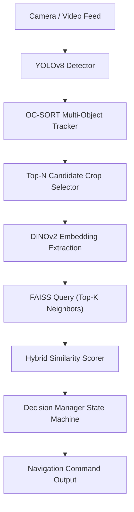

# 🦅 SKY UAV Vision Pipeline

This subdirectory contains the core real-time computer vision and decision pipeline for target flag detection and identification. It uses a hybrid scoring strategy combined with a multi-object tracker and temporal state machine to produce guidance commands for autonomous UAV flight controllers.

Refer to the root [README.md](file:///C:/Users/pc/OneDrive/Desktop/SKY/README.md) for overall project information, synthetic crop/video generators, and flight controller integration guidelines.

---

## ⚙️ Vision System Pipeline Architecture



### Main Modules (`core/`)

1. **`embedding_model.py`**: Preprocesses detection crops (ImageNet normalization, resizing to 224x224) and extracts visual features using a `dinov2_small` model.
2. **`database_builder.py`**: Scans folders of target template images, extracts embeddings in batches, and builds a FAISS `IndexFlatIP` search index.
3. **`similarity_scorer.py`**: Queries the FAISS index to calculate:
   * `sim_wk`: Weighted Top-K similarity (1/rank weighting).
   * `vote_frac`: Label consensus among nearest neighbors.
   * `margin`: Separation score between the best and second-best matching targets.
4. **`target_tracker.py`**: Implements an OC-SORT tracker with Kalman filtering to maintain identities across frames.
5. **`decision_manager.py`**: Resolves instantaneous detection variables into a rolling temporal confidence score ($C_{\text{final}} = C_{\text{temporal}} \times \text{stability}$) and manages the flight state machine.
6. **`visualizer.py`**: Draws bounding boxes color-coded by tracking state, displays a telemetry HUD, and renders scrolling state transition logs.
7. **`pipeline.py`**: Orchestrates the frames, calling each module sequentially.

---

## 💻 Running the Vision System on a Laptop

### 1. Build the FAISS Database Index (Offline)
Process the template images located in `../target_img/target_database_img/` to compile the search database:
```bash
python run_build_database.py --config config.yaml
```
This builds and saves the index to `./embeddings/index.faiss` and metadata to `./embeddings/labels.json`.

### 2. Run the Real-Time Pipeline (Online)
Run inference on a video source or webcam:
```bash
python run_pipeline.py --config config.yaml --source ../test_video/video.mp4
```
Press `Ctrl+C` to stop execution. The output will be written to `debug_output.mp4` as defined in `config.yaml`.

---

## 🍓 Running on a Raspberry Pi (Flight Controller Guide)

To run the pipeline on the drone's companion computer, compile both models to ONNX to leverage CPU acceleration (NEON/XNNPACK).

### 1. Export YOLOv8
```bash
yolo export model=weights/best.pt format=onnx imgsz=640 half=True
```

### 2. Export DINOv2
Run this script on a laptop to generate `dinov2_small.onnx`:
```python
import torch

model = torch.hub.load('facebookresearch/dinov2', 'dinov2_small', pretrained=True)
model.eval()
dummy_input = torch.randn(1, 3, 224, 224)

torch.onnx.export(
    model,
    dummy_input,
    "dinov2_small.onnx",
    opset_version=14,
    do_constant_folding=True,
    input_names=['input'],
    output_names=['output'],
    dynamic_axes={'input': {0: 'batch_size'}, 'output': {0: 'batch_size'}}
)
```

### 3. Load ONNX Runtime in `core/embedding_model.py`
Replace the PyTorch execution code with ONNX Runtime:
```python
import onnxruntime as ort
import numpy as np

opts = ort.SessionOptions()
opts.intra_op_num_threads = 4  # Match Pi's CPU cores
session = ort.InferenceSession("dinov2_small.onnx", sess_options=opts, providers=['CPUExecutionProvider'])

# Run inference on preprocessed numpy input (1, 3, 224, 224)
embedding = session.run(None, {'input': preprocessed_image})[0][0]
```

### 4. Companion Computer Efficiency Settings
* **Lower Candidates**: Set `max_candidates: 1` in `config.yaml` to only verify the highest confidence YOLO box per frame.
* **State Filtering**: Only run DINOv2 verification on tracking frames when the tracker state is `INVESTIGATING` or `VERIFYING`.
* **Frame Skipping**: Query DINOv2 once every 3 frames and let the OC-SORT tracker interpolate target positions on intermediate frames.